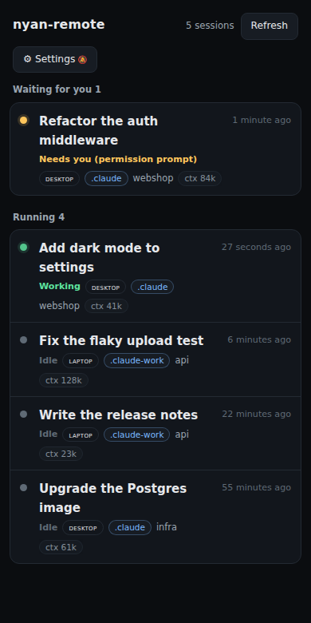
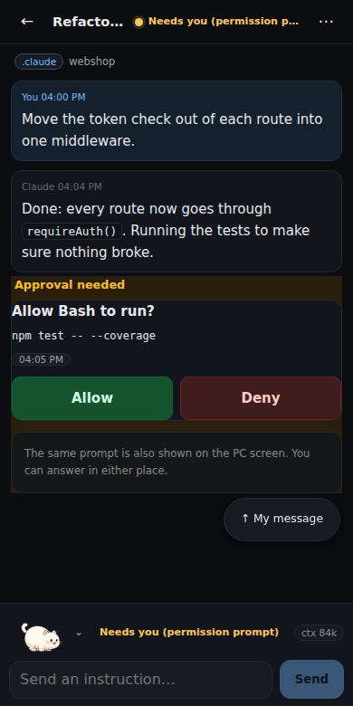
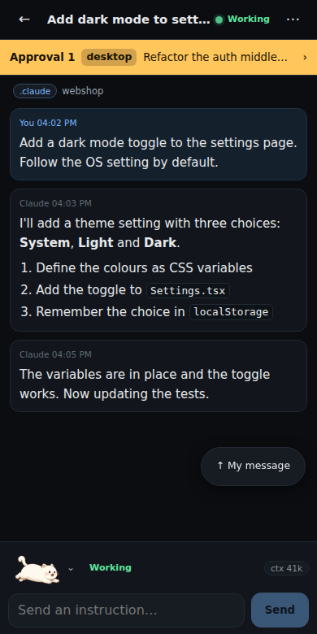

# nyan-remote

**Keep running `claude`. Use it from your phone.**

The sessions you already started — on every machine, in every account — in one list on your
phone. No tmux, no SSH, no relaunching under another command. `nyan-remote` runs one small agent
on each PC and gives you a phone web app with push notifications when a session finishes, fails,
or needs your approval, and lets you answer, reply, or stop it from there.

<p align="center">
  
  
  
</p>

---

## Why

Claude Code runs in a terminal on a machine you are not always sitting at. When it finishes,
hits an error, or asks for permission to run a command, you only find out when you come back.

nyan-remote makes those moments reach your phone, and lets you answer:

- **Keep typing `claude`.** Nothing to prepare before you leave: no wrapper command, no tmux, no SSH.
- **See every session** across machines and accounts in one list, with its current state.
- **Get notified** when a turn ends, a run fails, or a tool needs approval.
- **Approve or deny** permission prompts from your phone — including ones that would otherwise
  be auto-denied for background agents.
- **Reply, stop, or run a slash command** in a running session.

---

## Requirements

| | |
|---|---|
| **Agent (your PC)** | **Node.js 24+ only.** No npm, no git, no build step. Linux (systemd), macOS (launchd), or Windows through WSL. |
| **Phone** | Safari on iOS 16.4+ (add to Home Screen for notifications) or Chrome on Android. |

## Install

```bash
curl -fsSL https://app.nyan-remote.app/install.sh | bash
```

This downloads a ~3 MB tarball (sources, a prebuilt web app, and the runtime dependencies),
installs it under `~/nyan-remote`, registers a background service (`systemd --user` or launchd),
and wires up the Claude Code hooks. Then, in a new terminal:

```bash
nyan login     # our hosted relay (the default) requires it — GitHub sign-in
nyan pair      # shows a QR code; scan it with https://app.nyan-remote.app on your phone
```

On iPhone, add the app to the Home Screen first and scan from the Home Screen app: it keeps its data apart
from Safari, so a pairing done in a Safari tab does not carry over. (The app shows these steps on first launch.)

Everyday commands (`nyan help` lists them all):

| | |
|---|---|
| `nyan update` | update in place (pending approvals are checked first) |
| `nyan status` / `nyan logs` | service state and logs |
| `nyan devices` | registered phones (`--revoke` to remove one) |
| `nyan account` | your plan and limits on the hosted relay |
| `nyan uninstall` | remove it from this machine (see [Uninstall](#uninstall)) |

> Your state directory (`~/.nyan-remote`) is never touched by an update, and the previous tree is
> kept as `~/nyan-remote.old-<timestamp>` so you can go back.

### Adding a second machine

Run the same installer and pair your phone with it. That is all — there is no key to copy and
nothing to keep in sync. Each machine keeps its own notification key, and your phone holds a
separate push subscription per machine.

### Uninstall

```bash
nyan uninstall
```

This checks for pending approvals, signs the machine out of your account (freeing its slot), stops
and removes the background service, removes the Claude Code hooks, `notify.sh`, the `claude` entry
point on `PATH` and the `nyan` command, and deletes the installed tree (a git checkout is left in
place). Your own settings and shell files are kept; only the parts we added are removed.

The state directory (`~/.nyan-remote`: this machine's keys and registered phones) is **kept**, so
reinstalling later needs no re-pairing. `nyan uninstall --purge` deletes it too.

On the phone, remove the machine under **Connections**, and remove the app from the home screen if
you no longer use it.

---

## How it connects

Each agent dials **out** over WSS to a rendezvous relay; your phone connects to the same relay.
Neither side needs an inbound port, a certificate, or a fixed address.

```
 phone  ──WSS──▶  relay (Cloudflare Worker + Durable Object)  ◀──WSS──  agent (your PC)
            └──────────── end-to-end encrypted ─────────────┘
```

Three ways to connect, chosen **per machine**, so a mesh of several PCs can mix them:

| Route | What it needs | Notes |
|---|---|---|
| **`relay`** (default) | nothing | The agent only makes outbound connections. |
| **`relay`, self-hosted** | a Cloudflare account | Deploy `relay/` yourself, then set `relayUrl` in `config.json` ([steps](#run-the-relay-in-your-own-cloudflare-account)). |
| **`local`** | Tailscale | Direct; nothing leaves your machines ([steps](#use-tailscale-local)). |

> `local` needs the agent to have a **real HTTPS name**, not just a LAN address: this page is
> served over HTTPS, so browsers refuse to talk to `http://192.168.x.x`, and a LAN address cannot
> get a certificate. Tailscale is what gives the agent that name, and it is the supported way.

## Security model

- **Every device has its own key pair.** Pairing exchanges public keys through a QR code shown on
  the machine itself; a one-time code (5 minutes, single use, memory only) authorises exactly one
  registration. Revoking a device takes effect on connections that are already open.
- **Over `relay`, traffic is end-to-end encrypted** between the phone and the agent (ECDH P-256 +
  AES-GCM, with per-direction keys, transcript-bound key derivation, and replay protection). The
  whole implementation is one file, `shared/crypto.ts`, shared by both sides.
  **Over `local` there is no second layer**: requests go straight to your agent over HTTPS, so you
  are trusting TLS and your own network — which is the point of that route, since nothing leaves
  your machines.
- **The phone's private key is non-extractable** and stays in IndexedDB; it cannot be exported.
- **Notifications are per-machine too.** Your phone registers one service worker per paired
  machine and subscribes with *that machine's* key, so nothing is shared between agents.
- **The relay carries ciphertext.** It can see which public key talks to which, message sizes and
  timing — nothing else. It cannot read your code, prompts, or output.
- **No runtime dependencies** except `web-push` (so we do not hand-roll RFC 8291).

> We deliberately **do not** claim "zero third parties" or "no server". Strictly speaking that only
> holds for a private CA on a LAN, which a PWA cannot use. The honest claim is: *with `local`, your
> code and prompts never pass through anyone else; with `relay`, only ciphertext and metadata do.*

### What we ask of Claude Code

nyan-remote does **not** wrap or take ownership of the CLI. You keep starting sessions the way you
already do. It observes through the documented hook points, and sends input through a pty relay
only for sessions you started through its shim.

---

## Hosting the relay

The default relay is operated by us:

| Plan | Price | Limits |
|---|---|---|
| **Free** | $0 | 1 machine, 2 phones |
| **Plus** | $2.99/month or $24/year | 5 machines, 5 phones |

Sign in with `nyan login`; manage your plan at <https://account.nyan-remote.app>. Every feature works
on the free plan. If you would rather not depend on our relay, there are two alternatives, both free,
without an account and without limits. Both are set **per machine** in `~/.nyan-remote/config.json`
(`relayUrl`); restart the agent after changing it
(`systemctl --user restart nyan-remote`, or `launchctl kickstart -k gui/$(id -u)/app.nyan-remote.agent` on macOS).

### Run the relay in your own Cloudflare account

It is a single Worker plus a Durable Object; a personal deployment fits inside Cloudflare's free tier
with room to spare.

```bash
git clone https://github.com/vessel-ltd/nyan-remote.git
cd nyan-remote/relay
npm install                                    # wrangler (only needed here)
npx wrangler login
npx wrangler deploy -c wrangler.selfhost.jsonc # ⚠️ not the plain `wrangler.jsonc` (that one is our production relay)
```

Wrangler prints the address, e.g. `https://nyan-relay.<your-subdomain>.workers.dev`. On each PC, set

```json
{ "relayUrl": "wss://nyan-relay.<your-subdomain>.workers.dev" }
```

in `~/.nyan-remote/config.json` (keep the other keys), restart the agent, then run `nyan pair`.
No `nyan login` is needed: a self-hosted relay has no sign-in and no plans (up to 8 phones per machine).
Phones already paired over our relay need to scan the new QR code.

### Use Tailscale (`local`)

The phone talks to the agent directly over your tailnet; nothing goes through a relay.

1. Install Tailscale on the PC and on the phone, signed in to the same tailnet. In the admin console,
   turn on **MagicDNS** and **HTTPS certificates**. (On WSL, use Tailscale on the Windows side.)
2. Turn our relay off: `"relayUrl": ""` in `~/.nyan-remote/config.json` (restart after the next step).
   ⚠️ While a relay is configured, the QR code carries it and the phone pairs only through it.
3. Publish the agent on the tailnet (it listens on `127.0.0.1:7777` only):
   ```bash
   tailscale cert <machine>.<tailnet>.ts.net   # once, so the first visit does not time out waiting for the certificate
   tailscale serve --bg 7777
   ```
   (On WSL run both with `tailscale.exe` from Windows; run `cert` from PowerShell.) Then restart the agent: it accepts
   Tailscale identities only while `tailscale serve` forwards to it (checked at start and every 30 seconds).
4. On the phone, open **`https://<machine>.<tailnet>.ts.net/`** — the agent serves the app itself — and add it
   to the Home Screen. ⚠️ Use this address, not `app.nyan-remote.app`: the public app cannot reach an agent
   that has no relay.
5. Run `nyan pair` on the PC and scan the QR code from that app.

With several PCs, open the app from one of them (say `pc-a`) and pair the others from it. Each of the
**other** PCs has to accept that app's origin — add it to their `~/.nyan-remote/config.json` and restart:

```json
{ "allowedOrigins": ["https://pc-a.<tailnet>.ts.net"] }
```

(Nothing is accepted automatically: any web page served from any machine of your tailnet would otherwise be able to
use your Tailscale identity against the agent.)

> ⚠️ On a PC shared with other OS users, anyone logged in there can reach `127.0.0.1:7777` and pose as Tailscale;
> prefer the relay route on such machines.

Measured on the author's setup (3 machines, a full working day): the Durable Object was awake for
**69 seconds per day** — the hibernation design is what keeps self-hosting essentially free.

---

## Limits worth knowing

- **Accounts are `~/.claude` and `~/.claude-<name>`** (letters, digits, `.`, `_` and `-` in the name), once Claude Code
  has used them. Those are found automatically on every PC; config directories kept elsewhere are not set up for you.
- **Notifications and approvals work right away; typing into a session needs a fresh start.**
  The hooks apply to sessions that are already running. Typing, stopping and slash commands go through the
  `claude` entry point that the installer puts on `PATH`, so they work for sessions started in a new shell after
  installing. For older sessions, a reply is handed to Claude Code's inbox when that (experimental) CLI feature is
  available: Claude sees it with a short English note saying it came from another process, and messages that start
  with `/` or `!` are not sent that way.
- **Closing the terminal ends the session**, just like plain `claude`. nyan-remote keeps nothing
  alive on its own; if you want that, you can still run `claude` inside tmux yourself.
- **Windows needs WSL** for now.
- **iOS notification stacking.** iOS ignores notification `tag` replacement, so repeated updates
  pile up instead of replacing each other. Android replaces them as intended.
- **The web app is not served from the relay.** It is served over HTTPS from a public origin; the relay
  only carries traffic once the app is running.
- **One person, several machines.** There are no teams, roles, or sharing.

## Roadmap

- **Codex** — OpenAI Codex sessions in the same view.
- **Phone apps** — native apps for iPhone and Android.
- **Desktop** — a desktop layout, installable on Windows, macOS and Linux.
- **Windows without WSL** — run the agent on Windows directly.
- **Homebrew** — install and update with Homebrew on macOS.
- **Voice** — talk to a session and hear its replies read aloud, hands-free.

---

## Development

```bash
npm install
npm test                # node:test, no watch mode magic
npm run typecheck
NYAN_REMOTE_DEV=1 npm run dev
```

Several rules are enforced by tests rather than by convention — if `npm test` fails on a
discipline test, the fix is to change the code, not the test. The comments next to each rule explain
why it exists.

`node scripts/demo-serve.mjs` serves the built app with sample data (used for the screenshots above).

## Support

- **Bugs and feature requests:** [open an issue](https://github.com/vessel-ltd/nyan-remote/issues/new/choose)
- **Questions and ideas:** [Discussions](https://github.com/vessel-ltd/nyan-remote/discussions)
- **Billing and your account:** the contact form on [your account page](https://account.nyan-remote.app/#support)
- **Security problems:** please report privately — see [SECURITY.md](SECURITY.md)

## License

MIT © Vessel Ltd. (Vessel合同会社). See [LICENSE](LICENSE).

The cat sprites in `web/public/cats/` and `web/public/manul-cat.svg` are original artwork made for
this project and are covered by the same license.
